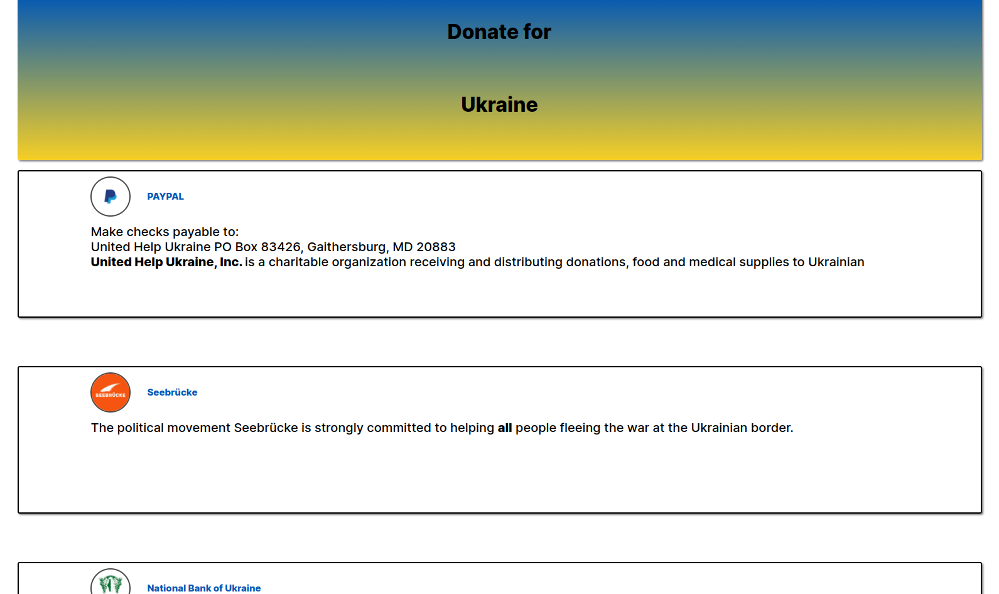
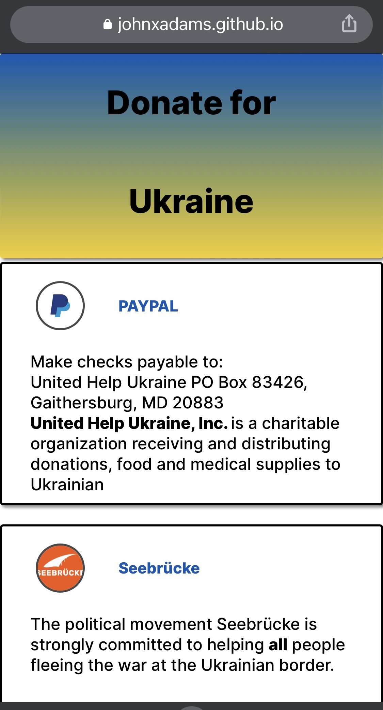

# project: donate-for-ukraine

**<a href="https://johnxadams.github.io/donate-for-ukraine/" target="_blank">click here to view the page </a>**

---

 
<h4>desktop-version</h4>
 

<h4>mobile-version</h4>
 

---

#### Navigation

- About Project
  - _Description_
  - _Developed With_
- How to use this Project
  - _Description_
  - _Developed With_
- Contact
  - _Mail_
  - _GitHub_
  - _LinkedIn_
- Used Tools
  - _Fonts_
  - [dribble](dribbble.com)
  - _Icons_
  - _Colors_

---

### About Project

War has broken out in the Ukraine. The people in the country are dependent on humanitarian aid financial support. It's not much which I have, so I created this page to encourage people in my area to surroundings to Ukraine.

### How to use this Project

On the page are some payment methods listed you can use to donate. Also you can read where you are donating to. Visit on of the pages to learn more by clicking on it.

##### Developed With

- [x] _HTML5_
- [x] _CSS3_
- [ ] _SASS_
- [x] _SCSS_
- [ ] _JavaScript_
- [ ] _React_
- [ ] _Bootstrap_
- [x] _npm_

---

### Contact

Mail: <johnxadams93@gmail.com> 
GitHub: [johnxadams](https://github.com/johnxadams) 
<!-- LinkedIn: [my linkedIn](#) -->

---

### Used Tools

<!-- - [icons](https://) -->
<!-- - [Google Fonts](https://fonts.google.com/) -->
- [npm](https://www.npmjs.com/)
- [Visual Studio Code](https://code.visualstudio.com/)
- [Gravit Design](https://designer.gravit.io/)
- [ColorZilla](https://www.colorzilla.com/chrome/)

---

Made with ❤️ by me
